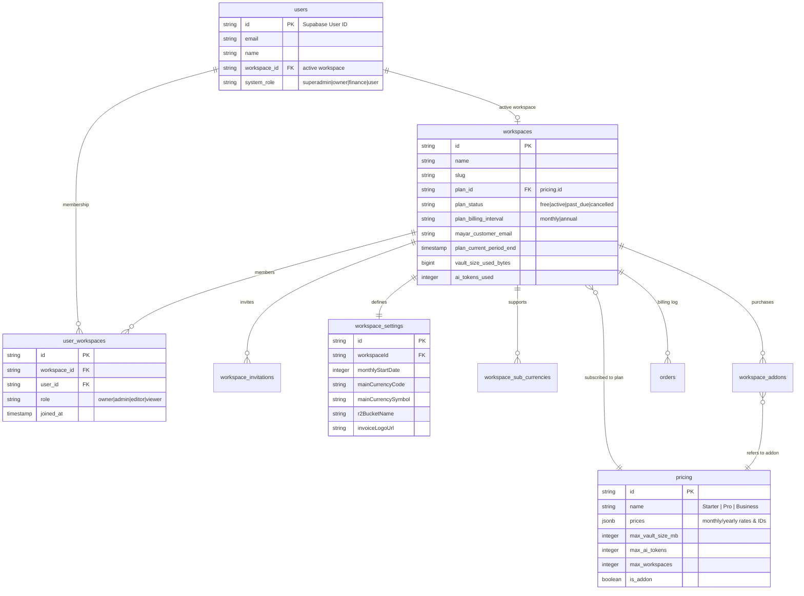

# Workspaces, Settings & Billing Architecture Guide

> See also: [docs/ARCHITECTURE.md](file:///Users/boneconsulting/Developer/oewang/docs/ARCHITECTURE.md) · [docs/FEAT_WORKSPACES.md](file:///Users/boneconsulting/Developer/oewang/docs/FEAT_WORKSPACES.md) · [docs/FEAT_SETTINGS.md](file:///Users/boneconsulting/Developer/oewang/docs/FEAT_SETTINGS.md) · [docs/FEAT_BILLING.md](file:///Users/boneconsulting/Developer/oewang/docs/FEAT_BILLING.md)

---

## 🤖 AI Agent: Update This Doc When
- Modifying relational models involving `users`, `workspaces`, `workspace_settings`, `pricing`, or `workspace_addons`.
- Modifying subscription gating middleware, plan verification utilities, or onboarding logic.
- Adding billing checkout or settings update APIs in `apps/api/modules/`.

---

## 1. Overview of Workspace tenancy

Oewang uses a **Multi-Tenant SaaS Architecture** where a **Workspace** is the primary tenant container. All financial records, wallets, transactions, budgets, settings, and files are isolated under a specific workspace.

### Core Architecture Concepts:
- **Workspace Isolation**: A workspace represents a distinct business/personal ledger. No data can be shared across workspaces.
- **Dynamic Active Workspace**: A user can be a member of multiple workspaces. The user's active workspace ID is embedded in their JWT token and governs all API request filters.
- **Settings Customization**: Each workspace contains its own set of formatting and display preferences.
- **Subscription Tiers**: Each workspace is bound to a specific billing plan defining its feature quotas and storage limits.

---

## 2. Entity-Relationship Model

The diagram below details how workspaces, users, settings, and billing tables interact:



---

## 3. Onboarding & Provisioning Flow

When a user signs up via Supabase, they have no active workspaces.

1. **Initial Authentication**: The frontend intercepts the login and exchanges the Supabase token via `POST /auth/token`.
2. **Null Workspace Redirection**: The API returns an app JWT with a `workspace_id: null` payload. The Next.js `middleware.ts` detects the null workspace ID and redirects the client browser to `/onboarding`.
3. **Workspace Provisioning**:
   - The user fills in the onboarding form (Workspace Name, Main Currency, Country).
   - The frontend calls `POST /v1/workspaces`.
   - The API creates a new `workspaces` row and assigns the default billing plan (e.g. `Free` plan).
   - The API inserts a `user_workspaces` row linking the user to the workspace with the `owner` role.
   - The API updates `users.workspace_id` to point to the new workspace.
   - The API seeds the workspace with **default income/expense categories** and a **default wallet**.
4. **Dashboard Entry**: The client requests a refreshed JWT containing the newly created `workspace_id` and enters the primary dashboard.

---

## 4. Workspace Settings & Integrations

Each workspace has a dedicated `workspace_settings` record containing functional preferences.

### Localization & Formats:
- **Main Currency**: Standard currency code (e.g. `IDR`, `USD`) and symbol format.
- **Reporting Period**: Budget limits calculate relative to the configured start day (`monthlyStartDate`).
- **Weekend Adjustment**: Configures if reporting periods start earlier/later when the start date falls on a weekend (`no-changes` | `prev-weekday` | `next-weekday`).

### Storage Integration (Cloudflare R2):
Workspaces can use the system-default Cloudflare R2 bucket or provide their own bucket.
- Custom R2 credentials (`r2AccessKeyId`, `r2SecretAccessKey`) are encrypted in the API using AES-256-GCM.
- When updated, fields are validated and saved.
- File uploads check if a custom R2 configuration exists; otherwise, they use the default system bucket credentials.

---

## 5. Subscription & Quota Management

Plans are defined in the `pricing` table. Limits are checked at the Service layer before mutations are allowed.

### Plan Gating Mechanics:
- **Workspace Limits**: Checked during `workspaces.service.ts` creation. Counts active workspaces owned by the user.
- **AI Token Limits**: Checked during AI chat and receipt processing. Compares `workspaces.ai_tokens_used` with the plan limit + `extra_ai_tokens` add-ons.
- **Vault Storage Limits**: Checked before uploading files in `VaultService`. Sums file sizes and compares against `max_vault_size_mb` + `extra_vault_size_mb`.

```ts
// Example API Quota Gate
if (workspace.vault_size_used_bytes + newFileSize > plan.max_vault_size_mb * 1024 * 1024) {
  return buildApiResponse({
    success: false,
    code: ErrorCode.PLAN_LIMIT_EXCEEDED,
    status: 422
  });
}
```

---

## 6. Mayar Billing Integration

All paid upgrades and add-on purchases are integrated with the **Mayar Payment Gateway**.

### Checkout Flow:
```
[Client] -> Requests checkout Link -> [API] -> Calls Mayar API (metadata: workspaceId)
                                                                 |
[Client] <- Returns checkout URL <- [API] <- Receives payment link from Mayar
   |
[User completes payment on Mayar checkout]
   |
[Mayar Webhook Server] -> Sends payment.received webhook -> [API Mayar Controller]
                                                                 |
                                                    API updates workspace subscription status
```

### Webhook Event Handling:
- **`payment.received`**: Verifies transaction payload, retrieves `workspaceId` and `planId` from metadata, and sets `plan_status = 'active'`. Sets expiration date (`plan_current_period_end`) by calculating the billing interval (1 month or 1 year).
- **`subscription.cancelled`**: Marks the subscription status as `cancelled`. The user retains premium access until `plan_current_period_end` is reached.

### Billing Lifecycle Daemon (Cron):
A periodic background worker evaluates subscription periods:
1. **Subscription Expiration**: If `plan_status == 'active'` and `plan_current_period_end < now()`:
   - Sets `plan_status = 'past_due'`.
   - Records `plan_overdue_started_at = now()`.
   - Sends notification and transactional reminder email.
2. **Grace Period Expiry**: If `plan_status == 'past_due'` and `plan_overdue_started_at < now() - 7 days`:
   - Downgrades workspace to the `Free` plan (`plan_id` resets, `plan_status = 'free'`).
   - Sends email alert advising the user of the downgrade and active quota limitations.
