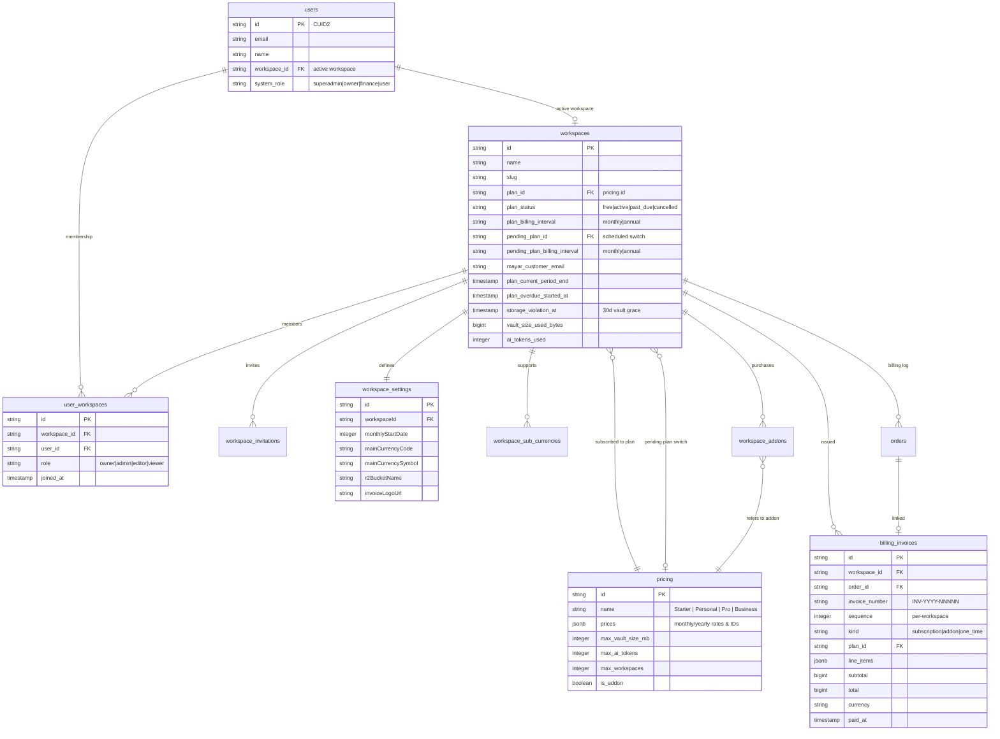

# Workspaces, Settings & Billing Architecture Guide

> See also: [docs/ARCHITECTURE.md](file:///Users/boneconsulting/Developer/oewang/docs/ARCHITECTURE.md) · [docs/FEAT_WORKSPACES.md](file:///Users/boneconsulting/Developer/oewang/docs/FEAT_WORKSPACES.md) · [docs/FEAT_SETTINGS.md](file:///Users/boneconsulting/Developer/oewang/docs/FEAT_SETTINGS.md) · [docs/FEAT_BILLING.md](file:///Users/boneconsulting/Developer/oewang/docs/FEAT_BILLING.md)

---

## 🤖 AI Agent: Update This Doc When

- Modifying relational models involving `users`, `workspaces`, `workspace_settings`, `pricing`, or `workspace_addons`.
- Modifying subscription gating middleware, plan verification utilities, or onboarding logic.
- Adding billing checkout or settings update APIs in `apps/api/modules/`.

---

## 1. Overview of Workspace tenancy

Oewang uses a **Multi-Tenant SaaS Architecture** where a **Workspace** is the primary tenant container. All financial records, wallets, transactions, budgets, settings, and files are isolated under a specific workspace.

### Core Architecture Concepts:

- **Workspace Isolation**: A workspace represents a distinct business/personal ledger. No data can be shared across workspaces.
- **Dynamic Active Workspace**: A user can be a member of multiple workspaces. The user's active workspace ID is embedded in their JWT token and governs all API request filters.
- **Settings Customization**: Each workspace contains its own set of formatting and display preferences.
- **Subscription Tiers**: Each workspace is bound to a specific billing plan defining its feature quotas and storage limits.

---

## 2. Entity-Relationship Model

The diagram below details how workspaces, users, settings, and billing tables interact:



---

## 3. Onboarding & Provisioning Flow

When a user registers, they have no active workspaces.

1. **Initial Authentication**: The API mints a JWT via `POST /auth/login`, `/auth/register`, or `/auth/oauth/connect`. The JWT contains `workspace_id: null` until a workspace is created.
2. **Null Workspace Redirection**: The API returns an app JWT with a `workspace_id: null` payload. The Next.js `middleware.ts` detects the null workspace ID and redirects the client browser to `/onboarding`.
3. **Workspace Provisioning**:
   - The user fills in the onboarding form (Workspace Name, Main Currency, Country).
   - The frontend calls `POST /v1/workspaces`.
   - The API creates a new `workspaces` row and assigns the default billing plan (e.g. `Free` plan).
   - The API inserts a `user_workspaces` row linking the user to the workspace with the `owner` role.
   - The API updates `users.workspace_id` to point to the new workspace.
   - The API seeds the workspace with **default income/expense categories** and a **default wallet**.
4. **Dashboard Entry**: The client requests a refreshed JWT containing the newly created `workspace_id` and enters the primary dashboard.

---

## 4. Workspace Settings & Integrations

Each workspace has a dedicated `workspace_settings` record containing functional preferences.

### Localization & Formats:

- **Main Currency**: Standard currency code (e.g. `IDR`, `USD`) and symbol format.
- **Reporting Period**: Budget limits calculate relative to the configured start day (`monthlyStartDate`).
- **Weekend Adjustment**: Configures if reporting periods start earlier/later when the start date falls on a weekend (`no-changes` | `prev-weekday` | `next-weekday`).

### Storage Integration (Cloudflare R2):

Workspaces can use the system-default Cloudflare R2 bucket or provide their own bucket.

- Custom R2 credentials (`r2AccessKeyId`, `r2SecretAccessKey`) are encrypted in the API using AES-256-GCM.
- When updated, fields are validated and saved.
- File uploads check if a custom R2 configuration exists; otherwise, they use the default system bucket credentials.

---

## 5. Subscription & Quota Management

Plans are defined in the `pricing` table. Limits are checked at the Service layer before mutations are allowed.

### Plan Gating Mechanics:

- **Workspace Limits**: Checked during `workspaces.service.ts` creation. Counts active workspaces owned by the user.
- **AI Token Limits**: Checked during AI chat and receipt processing. Compares `workspaces.ai_tokens_used` with the plan limit + `extra_ai_tokens` add-ons.
- **Vault Storage Limits**: Checked before uploading files in `VaultService`. Sums file sizes and compares against `max_vault_size_mb` + `extra_vault_size_mb`.

```ts
// Example API Quota Gate
if (
  workspace.vault_size_used_bytes + newFileSize >
  plan.max_vault_size_mb * 1024 * 1024
) {
  return buildApiResponse({
    success: false,
    code: ErrorCode.PLAN_LIMIT_EXCEEDED,
    status: 422,
  });
}
```

---

## 6. Mayar Billing Integration

All paid upgrades and add-on purchases are integrated with the **Mayar Payment Gateway**.

### Checkout Flow:

```
[Client] -> Requests checkout Link -> [API] -> Calls Mayar API (metadata: workspaceId)
                                                                 |
[Client] <- Returns checkout URL <- [API] <- Receives payment link from Mayar
   |
[User completes payment on Mayar checkout]
   |
[Mayar Webhook Server] -> Sends payment.received webhook -> [API Mayar Controller]
                                                                 |
                                                    API updates workspace subscription status
```

### Webhook Event Handling:

- **`payment.received` / `purchase` (success)**: Verifies the transaction payload, retrieves `workspaceId` and `planId` from `extraData`, sets `plan_status = 'active'`, calculates `plan_current_period_end` from the inferred billing interval, and **issues an internal `billing_invoices` row** with snapshotted line items.
- **`payment.failed`**: Marks the order failed, notifies the workspace owner, sends a payment-failed email.

> Mayar does not have a server-side cancellation event. User-initiated cancellation is handled entirely by our own `cancelSubscription` endpoint (see below).

### User-driven subscription actions

| Action | Endpoint | Effect |
| --- | --- | --- |
| Cancel | `POST /v1/mayar/cancel-subscription` | Sets `plan_status = 'cancelled'`. Workspace keeps premium access until `plan_current_period_end`. |
| Resume | `POST /v1/mayar/resume-subscription` | Reverts `plan_status` to `'active'` (only allowed while period_end is still in the future). |
| Schedule plan change | `POST /v1/mayar/schedule-plan-switch` | Persists `pending_plan_id` + `pending_plan_billing_interval`. Current plan stays active. |
| Cancel pending switch | `POST /v1/mayar/cancel-pending-plan-switch` | Clears the pending fields. |
| Cancel add-on | `POST /v1/mayar/cancel-addon` | Marks the addon `cancelled`. It stays active until its own period_end. |

All require the `owner` or `admin` workspace role.

### Billing Lifecycle Daemon (Cron):

`BillingLifecycleService.processLifecycle()` runs every 6 hours and walks the following decision tree for each workspace where `plan_current_period_end < now()`:

1. **`plan_status == 'cancelled'`** → downgrade to Starter. If `vault_size_used_bytes > Starter.max_vault_size_mb`, immediately set `storage_violation_at = now` so the 30-day vault grace period starts predictably.
2. **`plan_status == 'active'` AND `pending_plan_id` is set** → swap `plan_id` ← `pending_plan_id`, clear the pending fields, mark `past_due` (so the next checkout uses the new plan).
3. **`plan_status == 'active'`** (no pending switch) → mark `past_due`, send a payment reminder.
4. **`plan_status == 'past_due'`**:
   - Less than 7 days overdue: re-send escalating reminders every 3 days.
   - 7+ days overdue: downgrade to Starter (same vault grace logic as #1).

### Vault grace period

When the downgrade reduces the vault quota below current usage, the vault file lifecycle is:

```
day 0  → storage_violation_at = now (files visible)
day 30 → processStorageViolations cron marks files inactive (hidden, R2 preserved)
day 90 → hardDeleteExtendedInactiveFiles cron permanently deletes R2 blobs
```

At any time before day 90, the user can free space or upgrade — `storage_violation_at` clears and files reactivate automatically. The two crons live in `apps/api/scripts/storage-worker.ts`.

### Internal billing invoices

Every successful payment triggers `BillingInvoicesService.issue()` which writes a `billing_invoices` row with:

- Per-workspace sequential `invoice_number` (`INV-YYYY-NNNNN`) allocated under a row-level lock to prevent duplicates on concurrent webhook retries
- Snapshotted `line_items` (immutable — survives workspace renames, email changes)
- Idempotency on `mayar_transaction_id` (re-running the same webhook returns the existing invoice)

Users view invoices at `/settings/billing/invoices` and `/settings/billing/invoices/[id]`. The detail page is print-ready (browser native print dialog → save as PDF).

For deep dives on the implementation, see [FEAT_BILLING.md](./FEAT_BILLING.md).
